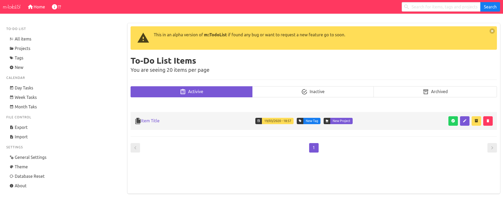
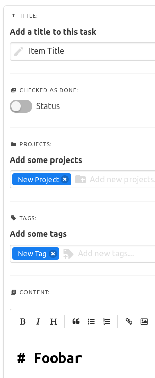
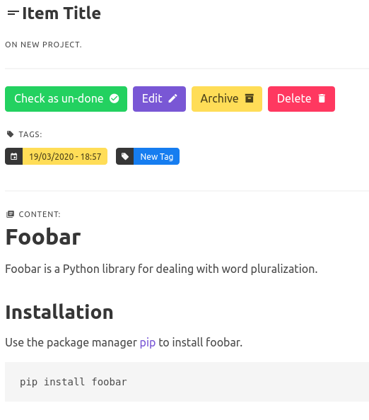

# m::TodoList


Are you exhausted from getting your google keep unorganized or even trying differents limited Kaban apps? Try an open-source experience for your problems!

## Features
- Client-based (everything is saved on your browser);
- Also can be server-based, so you can access your to-do list everywhere;
- Fully customizable (it's open-source);
- Vue powered;

## Screenshots
- Main page:



- Creating a new task:



- Task view:



## Installation
Download (or clone) the source code;
Run the following script on the downloaded folder:
```
npm run install
```

## Running the app
- For development mode run: `npm run serve`;
- For production mode or general cases, run: `npm run build`;
- You can use the app on itself site: https://metlhedd.github.io/todolist/

**WARNING!!** `vue.config.js` is set to be deployed on `/todolist/`, you can delete this file or you may edit it.

## Roadmap
* [X] File import/export;
* [ ] Create general settings (e. g.: items per page, etc...);
* [ ] Server-side feature;
* [ ] Upload attchatments;
* [ ] Search feature;
* [ ] Calendar system;
* [ ] Notifications (aka. reminders);
* [ ] Theming system;
* [ ] Activity log;
* [ ] Desktop app;
* [ ] Android app;
* [ ] iOS app;
* [ ] Extensios api.

## Docs
To be edited.